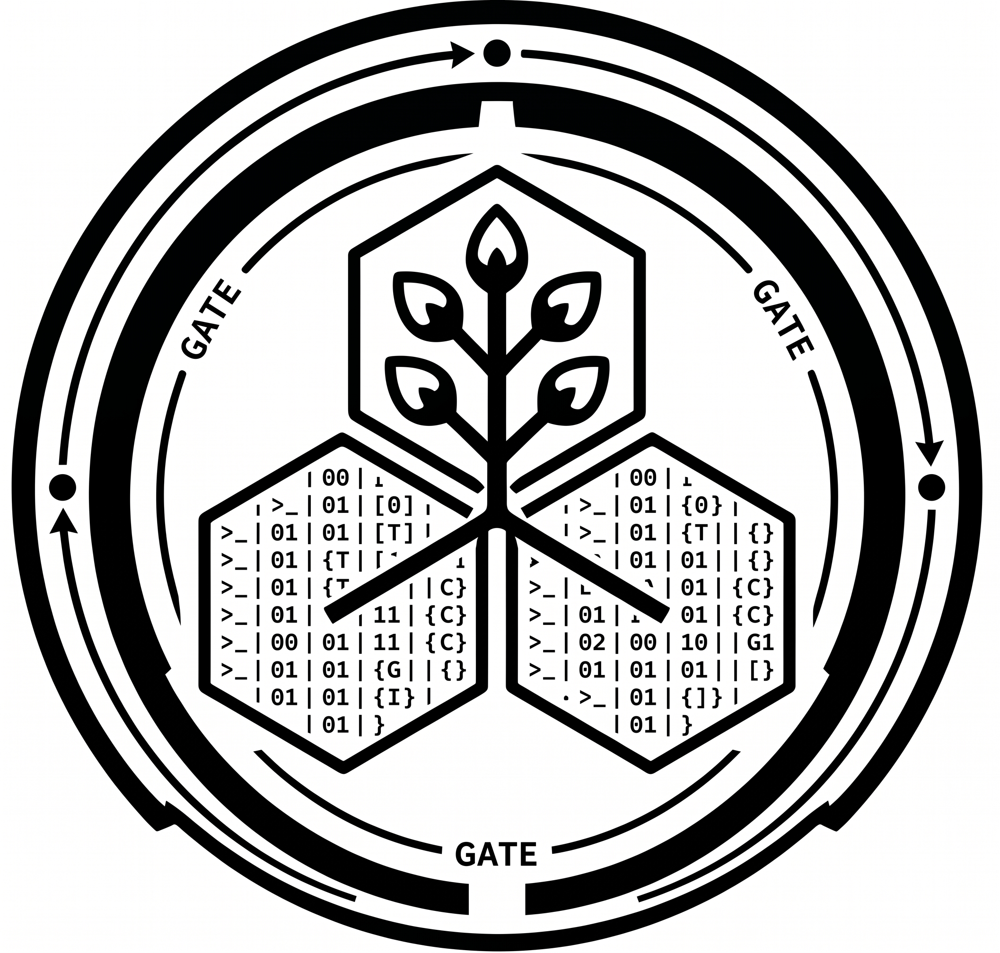

<p align="center">
  
</p>

<h1 align="center">KIRI</h1>

<p align="center">
  <em>Engineering-Grade Code Harness — Forged from Tradition, Built for Precision.</em>
</p>

<p align="center">
  An async Rust coding-agent harness for NVIDIA's OpenAI-compatible API —<br>
  every reasoning step, tool call, and diff visible and under human control.
</p>

---

## The idea

Most "AI coding" tooling optimizes for vibes: type a wish, watch a wall of edits scroll by, hope it
holds. **Kiri is the opposite.** It is a harness for real software engineers — a disciplined loop where
the model reasons out loud, proposes one concrete action at a time, and **you approve every tool call
before it touches the disk.** Production-grade safety, full visibility, human control. The agent does the
work; you keep the wheel.

The name carries the thesis. **Kiri** (桐) is the paulownia — the family *kamon*, and the wood of the
*kiri-dansu* chest that guards a household's most precious goods. It is also a homophone of 切り
("to cut", as in code). The mark is the **Kiri-Gate**: a *tsuba* — a katana's hand-guard — reimagined as
a containment ring, a **Quality Gate** the harness runs around your work. Inside it, three hexagons stand
for the foundations every change rests on: **Code · Infra · Data**. Monochrome, technical, forged — not
decorative.

## Preview

On launch, the harness greets you with the seal; once you start, the transcript streams live above a
borderless prompt whose gate glyph changes color with its state.

```
 ⬢ kiri  Engineering-Grade Code Harness

                            ▄▄▄███████▄▄▄
                         ▄▄████████████████▄▄
                       ▄████▀▀   ▄██▄   ▀▀████▄
                     ▄████▀   ▄███████▄▄   ▀████
                    ▄███▀    ███████████     ▀███
                   ▄███      ███████████      ▀███
                   ███       ███████████       ████
                  ████      ▄▄█▀██████▀▄▄▄      ███
                  ████  ▄▄██████▄▄▀▀▄███████▄   ███
                  ████  ██████████ ███████████  ███
                   ███  ██████████ ███████████ ▄███
                   ▀███▄██████████ ███████████▄███
                    ████▀▀██████▀▀  ▀███████▀████▀
                     ▀███▄ ▀▀▀▀        ▀▀▀  ▄███▀
                       ▀███▄             ▄▄███▀
                         ▀████▄▄▄▄▄▄▄▄▄▄████▀
                            ▀▀██████████▀▀

                          [ KIRI ]
        KIRI harness system: Protecting codebase... [OK]
           Forged from Tradition, Built for Precision

◈─ moonshotai/kimi-k2-instruct · ~/dev/Kiri · DEFAULT ─────◈
⬡ ›_
  Enter envia · ⇧Tab modo · Alt+Enter nova linha · ↑↓ histórico · arraste copia · ^C/^D sai · /help
```

## Features

- **Directed agent loop** — the model plans, then acts through tools, **one approved call at a time**.
- **Streaming reasoning + content** — thoughts and answer stream token-by-token over SSE.
- **9 filesystem tools** behind a **path sandbox** — the workspace root is the single I/O chokepoint.
- **Full-screen TUI** — a [ratatui](https://ratatui.rs) terminal UI: live transcript, a rich approval
  box, and slash commands (requires an interactive terminal).
- **Three approval modes** — cycle with `Shift+Tab`: **default** confirms every call, **auto** runs them
  unattended, **plan** stays read-only and proposes a plan you approve before it executes.
- **Runaway guard** — a 30-minute wall-clock checkpoint pauses long turns to ask whether to keep going.
- **Provider-agnostic, by API key** — NVIDIA (default), any OpenAI-compatible / custom endpoint,
  OpenAI (GPT), and Anthropic (Claude). Switch or add providers live from the TUI; secrets in the OS keyring.
- **Built to hold up** — modular-hexagonal, single binary, `unsafe` forbidden, green-gated.

## Getting started

**Prerequisites**

- Rust **stable** (edition 2024; `rust-toolchain.toml` pins the toolchain with `rustfmt` + `clippy`).
- An API key for at least one provider — e.g. NVIDIA from [build.nvidia.com](https://build.nvidia.com),
  Anthropic from the Console, or OpenAI from the Platform. **API key, not a subscription** — Kiri bills
  pay-per-token against your own account; subscription (Claude Pro/Max, ChatGPT Plus/Pro) is not supported.

**Configure** — Kiri manages its own config (`~/.kiri/config.toml`) and secrets (the OS keyring, or a
`0600` fallback file). There is **no `.env`**. The fastest start is to seed the default NVIDIA provider
from an env var on the first run; it is imported once into the keyring (the key is **never** a CLI flag):

```bash
export NVIDIA_API_KEY=nvapi-...
export NVIDIA_MODEL=moonshotai/kimi-k2-instruct   # any model from NVIDIA's catalog
```

Then add or switch providers from inside the TUI: **`/provider`** (switch, or run the add wizard for
Claude / GPT / a custom endpoint — paste the API key, it is masked and stored in the keyring),
**`/models`** (switch the model), **`/effort`** (reasoning effort). Generic keys also work via
`KIRI_<ID>_API_KEY` / `ANTHROPIC_API_KEY` / `OPENAI_API_KEY`.

**Build & run**

```bash
cargo build --release
cargo run                      # full-screen TUI on a terminal
cargo run -- "list the crates in this repo and summarize Cargo.toml"
```

## Usage

```text
kiri [OPTIONS] [PROMPT]

Arguments:
  [PROMPT]         Optional first message; the chat then continues interactively

Options:
      --path <DIR> Sandbox root for file tools (also via KIRI_PATH). Defaults to the current directory
  -h, --help       Print help
```

**Approval modes.** `Shift+Tab` cycles three modes (shown on the meta rule): **default** opens an
approval box for every tool call, **auto** runs them without asking, and **plan** offers only read-only
tools so the agent drafts a plan you approve before it runs. In the approval box, navigate with `↑`/`↓`
and `Enter` (or press `1`/`2`/`3`): **Sim**, **Sim, e não perguntar de novo** (switches to auto), or
**Não**. `Esc`/`n` declines just that call; `Ctrl+C` ends the session. Paths inside the workspace default
to accept; absolute or `~/` paths outside it default to decline.

**Key bindings (TUI)**

The composer follows the **macOS text-editing standard** — the Cocoa control bindings that work in
every native text field — so editing the prompt feels like editing anywhere on the Mac.

| Key | Action |
|---|---|
| `Enter` | Submit the prompt |
| `Alt+Enter` / `Shift+Enter` | Insert a newline |
| `Ctrl+A` / `Ctrl+E` | Move to line start / end |
| `Ctrl+B` / `Ctrl+F` | Move back / forward one character |
| `Option+←` / `Option+→` | Move by word |
| `Option+⌫` / `Ctrl+⌫` | Delete the previous word (`Option+⌦` / `Ctrl+⌦` the next) |
| `Ctrl+K` | Cut to end of line |
| `↑` / `↓` | Recall input history (at the first / last line) |
| `Shift`+motion · drag · double / triple click | Select text; `Ctrl+C` copies it (paste with `Cmd+V`) |
| `PgUp` / `PgDn` · `Ctrl+Home` / `Ctrl+End` · wheel | Scroll the transcript |
| `Shift+Tab` | Cycle the approval mode (default → auto → plan) |
| `Ctrl+C` | Copy the selection · else cancel the running turn · else quit (double-tap when idle) |
| `Ctrl+D` | Quit (empty input) |

**Copy from anywhere.** Drag the mouse over *any* region — the transcript, a tool's output, or the
composer — to select it; release (or `Ctrl+C`) copies it to the system clipboard. Double-click selects a
word, triple-click a line. Selection covers one screenful at a time; scroll, then select again for more.
The wheel still scrolls, and a key or scroll clears the highlight.

**Click to place the cursor.** A plain click inside the composer drops the edit cursor where you clicked,
on short prompts that fit without wrapping. Once a line soft-wraps or the box scrolls, a click is ignored
and the cursor stays put — rather than risk landing in the wrong spot (use the arrow keys there).

**macOS terminal note.** `Cmd` combinations never reach a terminal app, so line/word navigation lives on
`Ctrl`/`Option` (above), not `Cmd`. `Option+←/→` and `Option+⌫` require your terminal to send Option as
Meta — *iTerm2:* **Left Option key → Esc+**; *Terminal.app:* **Use Option as Meta Key**. Enabling that
disables dead-key accent composition (`Option+e` → `é`) on a US-International layout (an ABNT layout is
unaffected, since it has dedicated accent keys).

**Commands.** `/exit` (`/sair`, `/quit`) ends the session · `/new` (`/novo`) starts a fresh session ·
`/plan`, `/auto`, `/default` switch the approval mode · `/cd [path]` shows or changes the workspace ·
`/provider` switches the active provider or adds a new one (wizard) · `/models` switches the model ·
`/effort` switches the reasoning effort · `/help` lists everything. An unknown `/command` is flagged
instead of being sent to the model.

## Tools

Each tool resolves paths through the sandbox: relative paths stay under the workspace root (`..` and
symlink escapes are rejected), while absolute or `~/` paths reach outside it **only with your approval**.

| Tool | Purpose |
|---|---|
| `read_file` | Read a UTF-8 text file (capped at 64 KB) |
| `write_file` | Create or overwrite a file, making parent directories |
| `edit_file` | Replace the first exact occurrence of a string in a file |
| `delete_file` | Delete a file |
| `move_path` | Move or rename a file or directory |
| `list_dir` | List one level of a directory (directories suffixed with `/`) |
| `create_dir` | Create a directory, including parents |
| `delete_dir` | Delete a directory and its contents |
| `search` | Recursively search file contents for a substring |

## Architecture

Modular hexagonal (ports & adapters, vertical slices) in a single binary. Each module depends inward:
`domain` (pure data and rules) → `application` (use-cases and the **ports** they need, as traits) →
`infrastructure` (the **adapters** that implement them).

```
src/
  main.rs                 # ~8-line entry
  app.rs                  # composition root — wires adapters, picks the frontend
  shared/{kernel,infra}   # cross-cutting primitives; CLI + env + Settings
  modules/
    agent/                # conversation domain + the agent loop + the UI ports
    provider/             # CompletionProvider port + the NVIDIA OpenAI/SSE adapter
    tools/                # Tool trait + ToolRegistry + the sandbox + fs adapters
    tui/                  # the full-screen ratatui frontend (Elm-style state machine)
```

Invariants: network I/O lives only in `provider/infrastructure`, filesystem I/O only behind the sandbox,
and `domain` has no I/O at all. The decisions behind this are recorded as ADRs in
[`docs/decisions/`](docs/decisions/) — provider (0001), tools & sandbox (0002), architecture (0003),
the rename & TUI (0004), and the approval modes & plan flow (0005).

## Development

The definition-of-done gate — each must exit 0:

```bash
cargo fmt --check
cargo clippy --all-targets -- -D warnings
cargo build
cargo test
```

## Identity

The TUI wears the **Tamahagane Void** palette — deep steel-on-void, with sharp gate accents:

| Token | Hex | Use |
|---|---|---|
| Void | `#0D1117` | Background |
| Steel | `#E6EDF3` | Foreground text |
| Brand | `#8B949E` | Rules, delimiters, idle gate |
| Success | `#3FB950` | Passing gate / `[OK]` |
| Warning | `#D29922` | Notices, pending approval |
| Error | `#F85149` | Failures — the blade cut |
| Highlight | `#58A6FF` | Active input, streaming |

The full brand guide, logo, and harness icon live in [`docs/marca/`](docs/marca/).

## License

[MIT](LICENSE) © 2026 Theo Odawara
