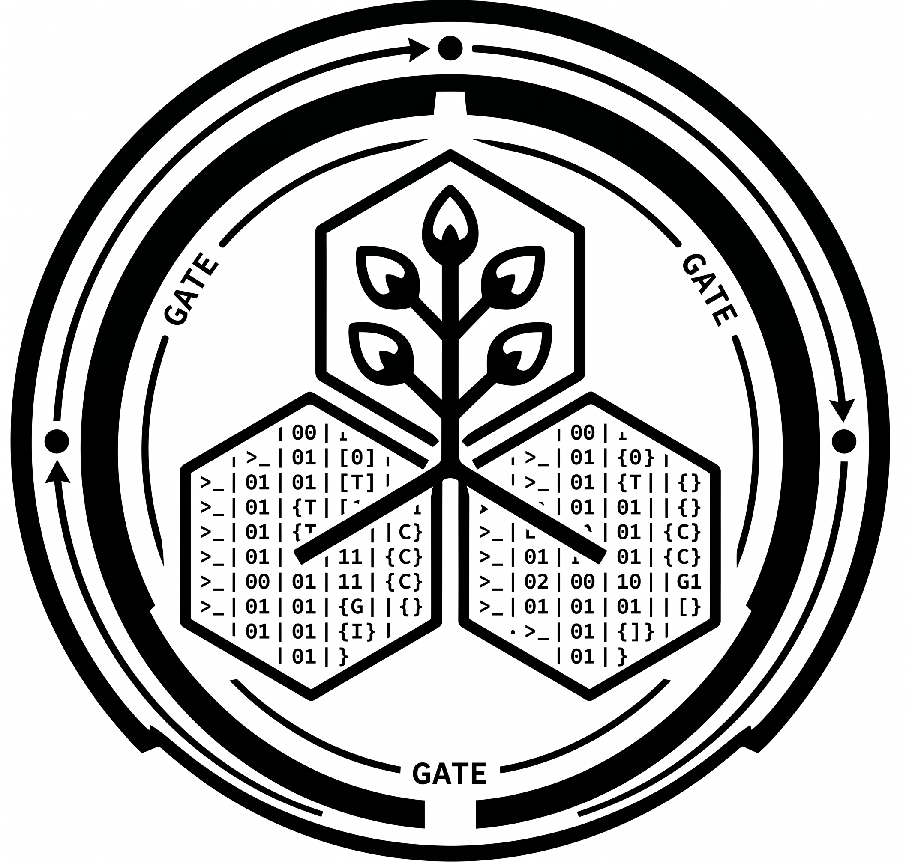

  

<h1 align="center">KIRI</h1>

  <em>Engineering-Grade Code Harness — Forged from Tradition, Built for Precision.</em>

  A terminal coding agent in Rust — 
  every reasoning step, tool call, and diff visible and under human control.

---

## Status

Kiri is being rebuilt from its requirements. No crate exists yet, so there is nothing to install or run.
The previous implementation was discarded; only the brand was kept.

## The idea

AI coding agents optimize for speed over control: edits scroll past, "done" is declared on red builds,
and each tool locks you to one vendor. Kiri is the opposite:

- **Full control** — every reasoning step, tool call, and diff is visible; nothing with side effects runs
  without your policy allowing it.
- **Any model** — bring the provider you have: an API key, a local model, or a subscription.
- **Built-in gate** — the agent cannot declare work finished while the repository's own checks are red.

The name carries the thesis. **Kiri** (桐) is the paulownia — the family *kamon*, and the wood of the
*kiri-dansu* chest that guards a household's most precious goods. It is also a homophone of 切り
("to cut"). The mark is the **Kiri-Gate**: the *go-shichi-no-kiri* crest inside a *tsuba*, a katana's
hand-guard read as a containment ring — the Quality Gate — around three foundations:
**Code · Infra · Data**.

## Documentation

| Doc | Holds |
| --- | --- |
| [Requirements](docs/requirements/README.md) | The versioned SRS: scope, milestones, and every requirement |
| [ADR 0001](docs/decisions/0001-architecture.md) | The architecture: daemon, ACP boundary, three crates |
| [Brand](docs/marca/) | Logo, seal, and palette |
| [AGENTS.md](AGENTS.md) | The repository contract for contributors and agents |

## License

[MIT](LICENSE) © 2026 Theo Odawara
