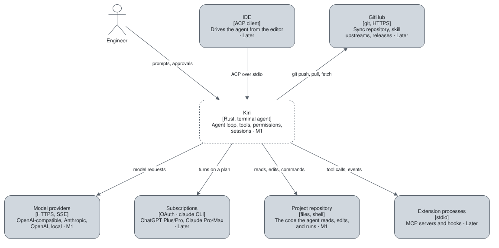

# Architecture

Kiri is a terminal coding agent: one engine, hosted by a per-user daemon, serves every front-end through
one protocol. The map below is inferred from [ADR 0001](../decisions/0001-architecture.md) and the
[requirements](../requirements/README.md). **Nothing is built yet**, so every Kiri element is drawn dashed
and carries the milestone that builds it: `M1` or `Later`.

## Quality goals

| Goal | Requirements |
| --- | --- |
| The user stays in control of every side effect | [BR-01](../requirements/business-rules.md#br-01), [BR-02](../requirements/business-rules.md#br-02), [FR-SAF-01 to 08](../requirements/functional/safety.md) |
| No crash, no hang, no silent failure | [NFR-REL-01 to 03](../requirements/non-functional/reliability.md) |
| Input stays live while the model streams | [NFR-PERF-01](../requirements/non-functional/performance.md#nfr-perf-01) |
| The same product on Windows, Linux, and macOS | [NFR-FLEX-01](../requirements/non-functional/flexibility.md#nfr-flex-01) |

Constraints: [requirements overview](../requirements/overview.md#constraints).

## Context and scope

| Actor or system | What flows | Protocol | Milestone |
| --- | --- | --- | --- |
| Engineer | Prompts and approvals in; reasoning, text, tool calls, and diffs out | Terminal | M1 |
| Model providers | Model requests out; streamed output in | HTTPS, SSE | M1 |
| Project repository | File reads, edits, and shell commands | Filesystem, child processes | M1 |
| Subscriptions | Turns on a ChatGPT or Claude plan | OAuth; the `claude` CLI in stream-json mode | Later |
| IDE | The same commands and events as the terminal | ACP over stdio | Later |
| Extension processes | Tool calls to MCP servers; events to hooks | stdio | Later |
| GitHub | The sync repository, skill upstreams, and releases | git, HTTPS | Later |

## Solution strategy

Each line is a decision of [ADR 0001](../decisions/0001-architecture.md).

- **One daemon per user owns every session.** Front-ends are thin clients; there is no embedded mode.
- **The boundary is ACP.** Clients send commands, the engine emits events, and Kiri-specific operations are
  `kiri/*` extension methods.
- **Three crates.** `kiri-core`, `kiri-tui`, and `kiri`; the compiler enforces the boundaries.
- **Modules by capability inside the engine.** They call each other directly; events exist only at the boundary.
- **Extensions are data and child processes.** Third-party code never runs inside the daemon.
- **Claude Pro/Max is an agent backend.** Its loop drives; Kiri's tools, permissions, and sandbox execute.
- **Persistence is text.** JSONL, TOML, and Markdown, so sync goes through git.

## Index

| Section | Holds |
| --- | --- |
| [Building blocks](building-blocks/README.md) | The three crates and the modules of the engine |
| [Runtime](runtime/README.md) | The scenarios the architecture must get right |
| [Deployment](deployment.md) | Where each block runs and how it reaches the user |
| [Concepts](concepts/README.md) | What cuts across blocks: security, streaming, persistence |
| [Risks](risks.md) | Risks and accepted costs |
| [Data model](../data-model/README.md) | Entities and their relations |
| [Decisions](../decisions/0001-architecture.md) | Why each choice was made |
| [Quality requirements](../requirements/non-functional/README.md) | The NFRs |
| [Glossary](../requirements/glossary.md) | Every domain term |

The import rules a reviewer checks live in the repository's `AGENTS.md`, section Architecture, not here.
