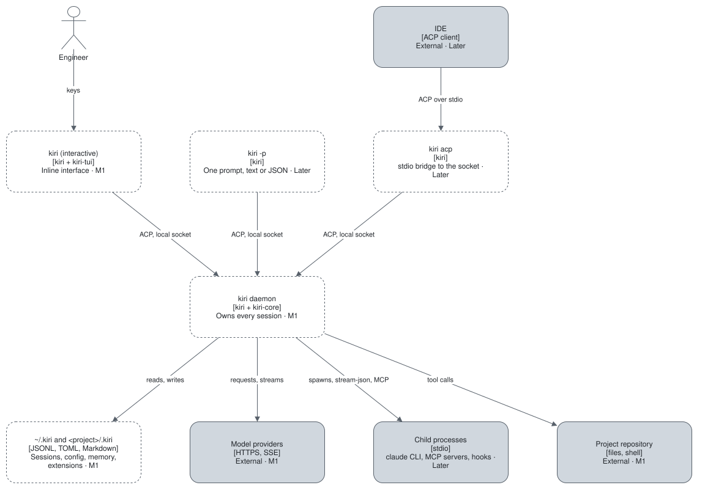

# Building blocks

The diagram shows the running processes; each is built from the crates below.

| Block | Technology | Responsibility | Talks to (protocol) | Milestone |
| --- | --- | --- | --- | --- |
| [kiri-core](kiri-core.md) | Rust library crate | The engine and the daemon's session host | Model providers (HTTPS, SSE); child processes (stdio); text files | M1 |
| [kiri-tui](kiri-tui.md) | Rust library crate | The interactive interface | The daemon (ACP over the local socket) | M1 |
| [kiri](kiri.md) | Rust binary crate | The `kiri` executable: `daemon`, the CLI, `-p`, `acp` | `kiri-core` and `kiri-tui` (function calls) | M1 |

A crate exists only when it has a consumer of its own.
