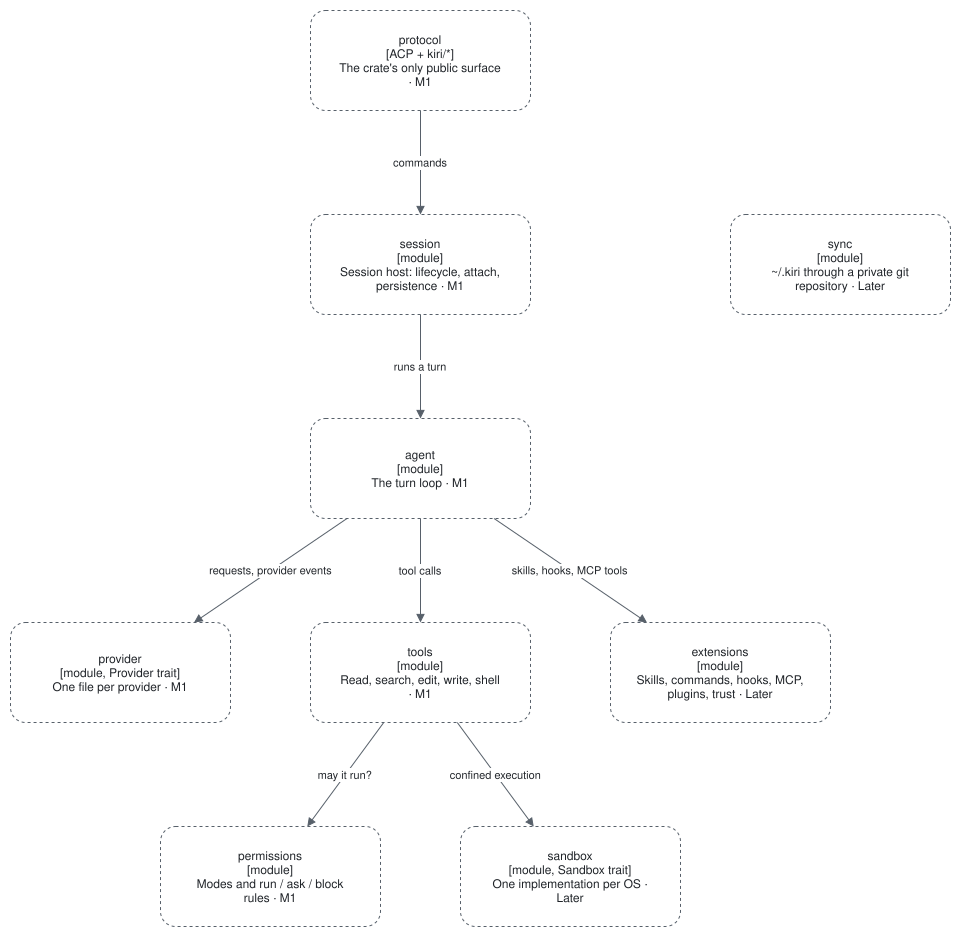

# kiri-core

The engine and the session host. Its public surface is the protocol only: ACP types and the `kiri/*`
extension methods. Milestone: M1.

## What it never does

- It never knows which front-end is attached.
- It never runs third-party code in its own process.
- It never uses events between its own modules.

## Inner blocks

| Module | Responsibility | Requirements | Milestone |
| --- | --- | --- | --- |
| `agent` | The turn loop; with the Claude subscription, the translation of the CLI's stream | [FR-AGT](../../requirements/functional/agent.md) | M1 |
| `provider` | The `Provider` trait and one file per provider; raw SSE bytes to provider events | [FR-PRV](../../requirements/functional/providers.md) | M1; subscriptions Later |
| `tools` | The built-in tools: read, search, edit, write, shell | [FR-TOL](../../requirements/functional/tools.md) | M1 |
| `permissions` | Approval modes and the run / ask / block rules; the classifier | [FR-SAF-01 to 06](../../requirements/functional/safety.md) | M1; classifier Later |
| `sandbox` | The `Sandbox` trait and one implementation per OS, selected at compile time | [FR-SAF-07](../../requirements/functional/safety.md#fr-saf-07) | Later |
| `session` | Session lifecycle, attach and reattach, persistence, subagents as child sessions | [FR-CNT-01 to 04, 08](../../requirements/functional/continuity.md) | M1; resume, rewind, messaging Later |
| `extensions` | Skills, commands, hooks, MCP servers, plugins, and trust | [FR-EXT](../../requirements/functional/extensions.md), [FR-SAF-08](../../requirements/functional/safety.md#fr-saf-08) | Later; trust M1 |
| `sync` | `~/.kiri` through a private git repository | [FR-CNT-06, 07](../../requirements/functional/continuity.md#fr-cnt-06) | Later |

The arrows of the diagram follow from the requirements, not from code; each spec confirms its own.

**Not placed in a module yet:** the built-in gate ([FR-GAT](../../requirements/functional/gate.md)) and
persistent memory ([FR-CNT-05](../../requirements/functional/continuity.md#fr-cnt-05)). ADR 0001 names eight
modules and neither is among them; the spec of each decides where it lives.

## Changing it safely

- A new provider is one file in `provider/` plus its registration.
- A new OS sandbox is one file in `sandbox/`.
- A trait needs two real implementations: today `Provider` and `Sandbox` only.
- Anything a client needs enters through the protocol; everything else stays `pub(crate)`.
