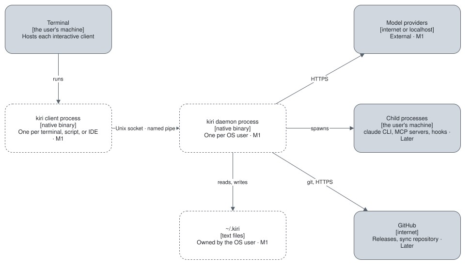

# Deployment

One environment: the user's machine. Nothing is hosted.

| Block | Runs as | Where | Milestone |
| --- | --- | --- | --- |
| `kiri` client | One process per terminal, script, or IDE | The user's machine | M1 |
| `kiri daemon` | One process per operating-system user | The user's machine | M1 |
| State | Text files under `~/.kiri` and `<project>/.kiri` | The user's disk | M1 |
| Child processes | The `claude` CLI, MCP servers, hooks | The user's machine | Later |

The transport between client and daemon is a Unix domain socket on Linux and macOS and a named pipe on
Windows, restricted to the owning user ([NFR-SEC-02](../requirements/non-functional/security.md#nfr-sec-02)).

## Packaging and install

Nothing is installable yet. The planned channels are [FR-DST-01 to 05](../requirements/functional/distribution.md),
all `Later`.

## Delivery

- **Gates:** the repository's `AGENTS.md`, section Commands. Today only the docs build exists.
- **CI:** none. No workflow exists in the repository.
- **Branches:** work branches merge into `staging` by pull request; a release is a merge of `staging` into `main`.
