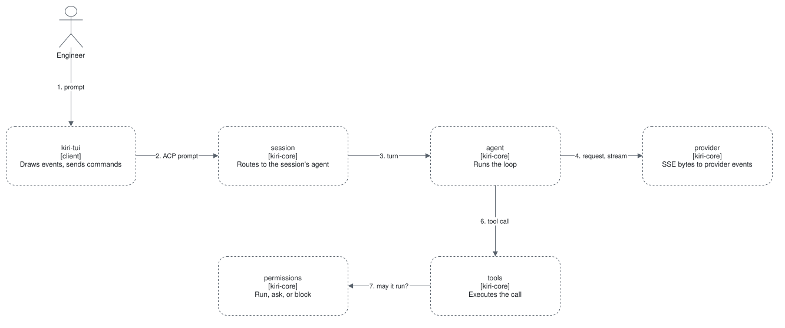

# A prompt turn

One prompt, from the keyboard to the final answer. Milestone: M1.
Requirements: [FR-AGT-01, 02](../../requirements/functional/agent.md),
[FR-SAF-02](../../requirements/functional/safety.md#fr-saf-02).

1. The engineer types a prompt in **kiri-tui**.
2. **kiri-tui** sends the prompt as an ACP command over the local socket to the daemon.
3. **session** routes it to the **agent** of that session.
4. **agent** calls **provider**, which turns the raw SSE bytes into provider events.
5. **agent** groups the events into batches of about 10 ms and emits them as ACP events; **kiri-tui** draws
   them.
6. When the model calls a tool, **agent** hands the call to **tools**.
7. **tools** asks **permissions**: run, ask, or block. On ask, the daemon emits an approval-needed event,
   **kiri-tui** shows it, and the engineer's answer returns as an ACP command.
8. **tools** executes the call — inside **sandbox** once it exists — and the result returns to the model.
9. Steps 4 to 8 repeat until the model answers; **agent** emits the turn-end event and **session** persists
   the conversation.
