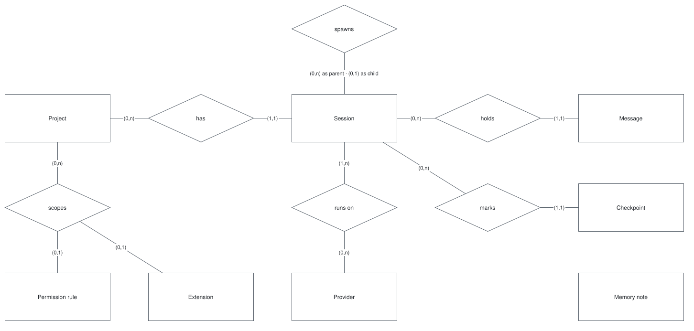

# Data model

Only the conceptual model exists. It is inferred from the [requirements](../requirements/README.md) and
[ADR 0001](../decisions/0001-architecture.md); no attribute and no file layout has been decided.

## Entities

| Entity | One instance is | Requirements | Milestone |
| --- | --- | --- | --- |
| Project | A directory the user works in | [FR-CNT-03](../requirements/functional/continuity.md#fr-cnt-03) | M1 |
| Session | One conversation, owned by the daemon | [FR-CNT-01](../requirements/functional/continuity.md#fr-cnt-01) | M1 |
| Message | One entry of a session's conversation | [FR-AGT-01](../requirements/functional/agent.md#fr-agt-01) | M1 |
| Provider | One configured source of model output | [FR-PRV-09](../requirements/functional/providers.md#fr-prv-09) | M1 |
| Permission rule | One rule making an action run, ask, or be blocked | [FR-SAF-04](../requirements/functional/safety.md#fr-saf-04) | M1 |
| Checkpoint | A point of a session its file edits can return to | [FR-CNT-04](../requirements/functional/continuity.md#fr-cnt-04) | Later |
| Extension | One skill, command, hook, MCP server, subagent definition, or plugin | [FR-EXT](../requirements/functional/extensions.md) | Later |
| Memory note | One fact or preference kept across sessions | [FR-CNT-05](../requirements/functional/continuity.md#fr-cnt-05) | Later |

## Relations

- A project has zero or more sessions; a session belongs to one project.
- A session holds zero or more messages and marks zero or more checkpoints.
- A session spawns zero or more child sessions: a subagent is a child session.
- A session runs on one provider at a time and on several over its life, because the provider is switchable live.
- A permission rule and an extension are global or scoped to one project.
- A memory note has no relation yet: whether memory is global, per project, or both is not decided.

## Not written yet

- **Logical model** — one file per entity, with attributes, identity, and invariants. Each entity's spec decides them.
- **Access patterns** — they need the volumes each spec sets.
- **Storage** — the formats and locations are fixed ([persistence](../architecture/concepts/persistence.md)); which
  file holds which entity is decided by each spec.
